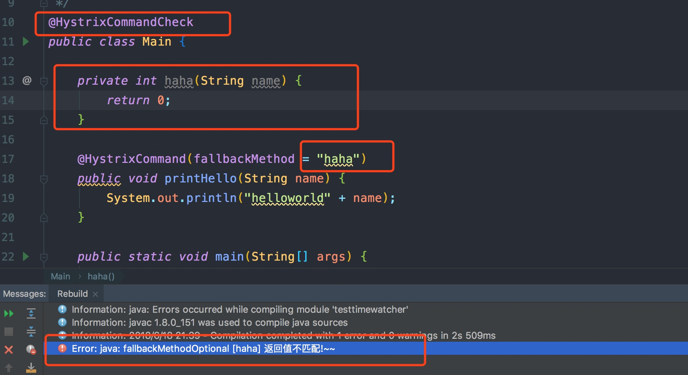

这是1个在编译期检查@HystrixCommand 注解fallbackMethod 语法的工具

使用方式：
添加maven 依赖，同时这个依赖应该加在dev profile 下，其他profile 不应该有这个jar 包
```xml
<dependency>
            <groupId>com.bobo</groupId>
            <artifactId>hystrix-check</artifactId>
            <version>1.0-SNAPSHOT</version>
        </dependency>
```
在任一1个Java类上添加如下注解，通常是入口类，例如SpringBoot 项目的启动类
```text
@HystrixCommandCheck
```
目前主要检查，所有fallback 方法必须是私有的，并且返回类型和参数列表必须和声明@HystrixCommand 注解的方法保持一致
最终效果：

